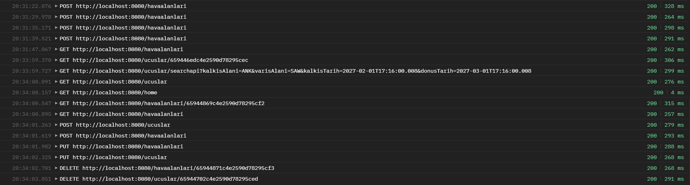

# Flight Search API

Bu proje, bir uçuş arama uygulamasının backend API'sini sağlamak için geliştirilmiştir.

## **Controller Yapıları**

### 1. UcuslarAPIController

### **`GET /ucuslar/{id}`**

Belirtilen ID'ye sahip uçuş detaylarını getirir.

### **`GET /ucuslar`**

Tüm uçuşları getirir.

### **`POST /ucuslar`**

Yeni bir uçuş oluşturur.

### **`PUT /ucuslar`**

Varolan bir uçuşu günceller.

### **`DELETE /ucuslar/{id}`**

Belirtilen ID'ye sahip uçuşu siler.

### **`GET /ucuslar/searchapi`**

Belirtilen kalkış yeri, varış yeri, kalkış tarihi ve dönüş tarihine uygun uçuşları listeleyen API endpoint'i.
Tek yönlü uçuş için tek uçuş bilgisini, çift yönlü uçuş için iki uçuş bilgisini verir.

### 2. HavaalanlariAPIController

### **`GET /havaalanlari/{id}`**

Belirtilen ID'ye sahip havaalanı detaylarını getirir.

### **`GET /havaalanlari`**

Tüm havaalanlarını getirir.

### **`POST /havaalanlari`**

Yeni bir havaalanı oluşturur.

### **`PUT /havaalanlari`**

Varolan bir havaalanını günceller.

### **`DELETE /havaalanlari/{id}`**

Belirtilen ID'ye sahip havaalanını siler.

### 3. UserController

### **`GET /home`**

Anasayfa. Tüm kullanıcılara açıktır.

****
### **API'ler İçin Postman Üzerinden Yapılan Test Sonuçları**

****
### **Güvenlik**

- Basic Authentication kullanılmıştır.
- Yetkilendirme yapıları Controller sınıflarına göre eklenmiştir. UcuslarAPIController ve HavaalanlariControllerAPI sınıflarına uygulanan authentication yapısı için username admin, password 1234 olarak belirlenmiştir.
- Diğer controller sınıfları ile arasındaki farkı görebilmek için /home’a herhangi bir authentication eklenmedi.

### **Swagger API Dokümantasyonu**

- Proje, Swagger ile API dokümantasyonu sağlamaktadır. API endpoint'leri ve kullanım detayları Swagger UI üzerinden incelenebilir.
- Tarih gönderilirken datetime tipinde gönderilmelidir.

### **Veritabanı**

- Veritabanı olarak MongoDB kullanılmıştır.
- Uçuşlar ve havaalanları verileri düzenli bir şekilde saklanmaktadır.

### **Scheduled Background Job**

- Her gün mock bir API'a istek atarak uçuş bilgilerini alan ve veritabanına kaydeden bir scheduled job uygulanmıştır. `https://run.mocky.io/v3/1305924e-8c86-4759-acca-5620d6210252`